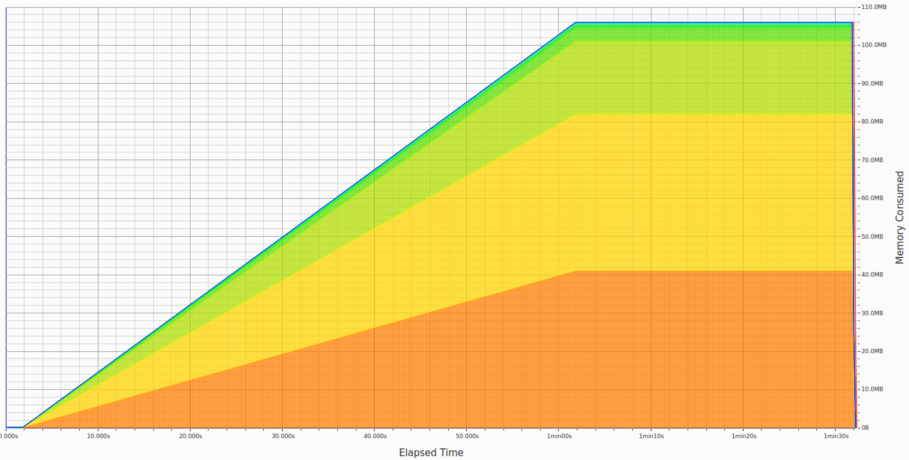
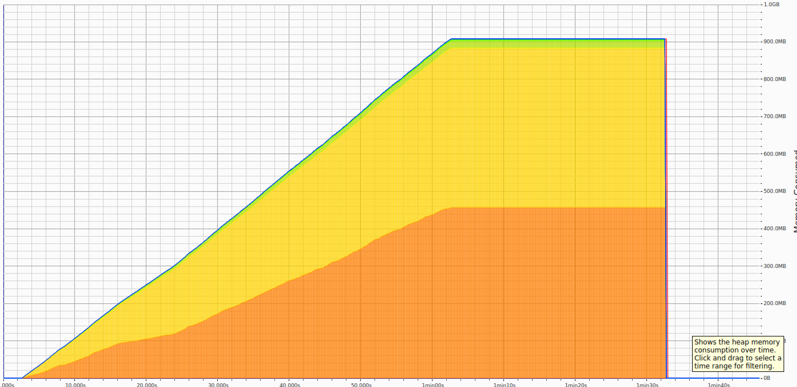

# Benchmark memory usage of tokio-tungstenite between 0.24 and 0.25

The source code is the official ping/pong example from the tokio-tungstenite repository.

The results are obtained with [`heaptrack`](https://github.com/KDE/heaptrack), a heap memory profiler and [`k6`](https://k6.io/open-source/) a load tester.

## tokio-tungstenite 0.24.0
* Calls to allocation functions: 341,152 (3,694/s)
* Temporary allocations: 60,021 (17.59%, 649/s)
* Peak heap memory usage: 106.1MB
* Peak RSS: 119.6MB
* Total runtime: 1min32s

[heaptrack 0.24 file](heaptrack-tokio-tungstenite-0.24.gz)

## tokio-tungstenite 0.25.0
* Calls to allocation functions: 324,172 (3,064/s)
* Temporary allocations: 68,341 (21.08%, 646/s)
* Peak heap memory usage: 908MB
* Peak RSS: 936MB
* Total runtime: 1min45s

[heaptrack 0.25 file](heaptrack-tokio-tungstenite-0.25.gz)

## Reproduction steps
* install [k6](https://k6.io/open-source/)
* `cd tokio-tungstenite-0-24 && cargo run -r -p`
* `k6 run k6-script.js`
* `cd tokio-tungstenite-0-25 && cargo run -r -p`
* `k6 run k6-script.js`
